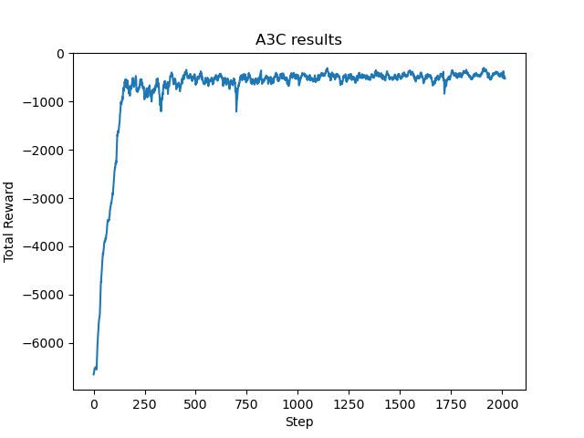

*Asynchronous Advantage Actor-critic (A3C) Algorithm and Deep Deterministic Policy Gradient (DDPG) Algorithm*

Zirui Liu 519021910343
Beichen Yu 519030910245

[TOC]

# 1 Introduction

Algorithms such as deep *Q* networks have achieved good performance in solving complex tasks with unprocessed, high-dimensional inputs. However, *DQN* is only able to solve problems that are discrete and located in low-dimensional action spaces due to the need to find discrete actions that maximize *Q*. With the continuity property of *policy gradient*, the *Actor-Critic* algorithm can be used to solve problems with continuous and high-dimensional action spaces. In this paper, we present two improved algorithms based on the *AC* algorithm: the ***Asynchronous Advantage Actor-critic (A3C)*** algorithm and the ***Deep Deterministic Policy Gradient (DDPG) Algorithm***, with experiments and performance analysis in the *gym* environment of *Pendulum-v0* (*Pendulum-v1*). Since in our implemented version of gym, *Pendulum-v0* has already been discarded and replaced by *Pendulum-v1*(actually the same thing), so in the next following sections *Pendulum-v0* and *Pendulum-v1* means the same thing.

## 1.1 Actor-critic (AC) Algorithm

*Actor-Critic* typically consists of two parts, the actor (*Actor*) and the evaluator (*Critic*). For the first part, *Actor* uses policy functions and is responsible for generating actions (*Action*) and interacting with the environment. And for the second part, *Critic* uses the value function, which is responsible for evaluating the performance of *Actor* and guiding the next stage of the Actor's action. In the *Actor-Critic* algorithm, we need to make two sets of approximations, which have also been mentioned in *Policy-based Reinforcement Learning*.

- The first set is the approximation of the policy function.

    $\pi_{\theta}(s, a) \ = \ P(a|s, \theta) \ \approx \ \pi(a|s)$

- The approximation of the value function at the second group, for the state value and action value functions, respectively, is

    $\hat v(s, w) \ \approx \ v_\pi(s)$

    $\hat q(s, a, w) \ \approx \ q_\pi(s, a)$

In the previously learned *Monte-Carlo Policy Gradient (REINFORCE)* algorithm, we update the network parameters by the stochastic gradient ascent *Stochastic Gradient Ascent* method, referring to the policy gradient theorem, and use the return value $v_t$ to as the *unbiased sample* of $Q^{\pi_\theta}(s_t, a_t)$, yielding the parameter update formula of the strategy as

$\Delta \theta \ = \alpha \nabla_\theta \log \pi_\theta(s_t, a_t)v_t$

For *Actor* in the *AC* system, the above formula for policy update is needed to keep updating the parameters and generating optimal actions. However, unlike *Monte-Carlo Policy Gradient (REINFORCE)*, the $v_t$ in the formula no longer comes from Monte-Carlo sampling, but should be obtained from another component of the *AC* system, which is *Critic*. For *Critic* part, we refer to *DQN* and use a *Q* network for the representation, where the input can be the state and the output is the value of the optimal action or the respective value of all actions.

Thus, the main framework of the *AC* algorithm is.

*(1)* *Critic* computes the optimal value $v_t$ of the current state through the *Q* network and returns it to *Actor*; after getting the feedback and the new state from *Actor*, it updates the *Q* network

*(2)* *Actor* iteratively updates the argument $\theta$ of the policy function using $v_t$ and selects the action with it, gets the feedback and the new state, and returns it to *Critic*


## 1.2 Asynchronous Advantage Actor-critic (A3C) Algorithm

In the use of the *AC* algorithm, although single-step updates are possible, which are faster than the round updates of the traditional *Policy Gradient* algorithm, the algorithm itself is difficult to converge because the behavior of *Actor* depends on the *Value* of *Critic*, and since *Critic* is inherently difficult to converge. The reason is that the behavior of *Actor* depends on the *Value* of *Critic*.

To address the above problem, we can use empirical replay to solve the hard-to-converge problem by referring to the implementation of the *DQN* algorithm. However, there is a problem with the experience replay itself, as the experience data in the replay pool is too correlated and is likely to be ineffective when used for training.

The *A3C* algorithm solves the problem of experience replay data correlation based on the idea of experience replay, using a multi-threaded method of learning by interacting with the environment simultaneously. In the multi-thread, each thread aggregates the successes learned from its own interaction with the environment, organizes and saves them in a common place, and periodically brings out the results of everyone's concerted learning to guide its own learning interactions with the environment later, in order to achieve the goal of **asynchronous parallelism**. The network structure of the *A3C* algorithm is shown in the figure below.


The *A3C* algorithm was first proposed by *DeepMind* to solve the problem of difficult convergence of the *Actor-Critic* algorithm. The *A3C* algorithm exploits the power of parallel computing by creating multiple parallel environments in which multiple *workers* with the same *AC* network structure (*local network*) interact independently, store their experiences, and perform periodic parameter updates to the *Global AC Network* simultaneously. While the parameters are updated, each *worker* also updates its own *local network* with the network parameters of the *global network*, thus reducing the correlation of parameter updates and thus improving the convergence of the whole algorithm on the basis of guaranteed iterative learning. The pseudo-code of the *A3C* algorithm is as follows.


Compared to the traditional *AC*, the *A3C* algorithm has three main improvements.

- **Asynchronous training framework**.

    The ***Global Network*** above in the previous figure is the shared common part stated in *1.2* section, which is mainly a common neural network model. This neural network** includes the functions of both *Actor* network and *Critic* network**. There are ***n* *worker* threads**, **each of which has the same network structure as the common neural network**, and each thread will independently interact with the environment to get the experience data, and these threads will **not interfere with each other and run independently**.

    After interacting with the environment for a certain amount of data, each thread computes the gradient of the loss function of the neural network in its own thread, but these gradients do not update the neural network in its own thread, but update the public neural network. That is, ***n* threads independently update the parameters of the common part of the neural network model** using the accumulated gradients. ** Every once in a while, the threads update the parameters of their own neural network to those of the public neural network, which in turn guides the later environmental interactions**.

    As can be seen, the public part of the network model is the model we want to learn, while the network model in the thread is mainly used for interaction with the environment. These models in the thread can help the thread to better interact with the environment and get high-quality data to help the model converge faster.

- **Network Structure Optimization**.

    Unlike the *AC* algorithm, here we logically merge the *Actor* and *Critic* networks, i.e., input state, output state value $v_t$ and the corresponding policy $\pi$, but of course, the binaries are still physically two separate networks, handled separately as follows


- Optimization of ***Critic* evaluation points**.

    In the *AC* algorithm, we discuss the use of single-step sampling to approximate the estimation of $Q(S, A)$, i.e.: $Q(S, A) = R + \gamma V(S')$, where the value of $V(S)$ needs to be obtained by *Critic* network learning. Thus the dominance function can be expressed asis 

    $A(S, t) \ = \ R + \gamma V(S') - V(S)$

    In the *A3C* algorithm, **N* step sampling is used to speed up convergence**, so the dominance function can be expressed as

    $A(S, t) \ = \ R_t + \gamma R_{t+1} + ... + \gamma^{n-1}R_{t+n-1} + \gamma^n V(S') - V(S)$

    The loss function part for *Actor* and *Critic* is essentially the same as for *AC*. One small optimization point is to add the entropy term of the strategy $\pi$ to the loss function of the *Actor-Critic* strategy function with a coefficient of *c*, i.e., the gradient update of the strategy parameters becomes the following form.

    $\Delta \theta \ = \alpha \nabla_\theta \log \pi_\theta(s_t, a_t)A(S, t) + c \nabla_\theta H(\pi(S_t, \theta))$


## 1.3 Deep Deterministic Policy Gradient (DDPG) Algorithm

Deep Deterministic Policy Gradient (DDPG) is a model-free off-policy actor-critic algorithm that combines *DQN* and *DPG*. As it is an off-policy algorithm, *DDPG* uses two separate policies for the exploration and updates. It uses a stochastic behaviour policy for the exploration, and deterministic policy for the target update.


* Network Schematics

As another improved algorithm based on the *AC* algorithm, *DDPG* has two networks: actor and critic. The actor produces the action to explore, and during the updating of the actor, TD error from a critic is calculated, and the critic network is updated based on the it which is similar to Q-learning update rule. 

In *DDPG*, four neural networks are used: a Q network, a deterministic policy network, a target Q network, and a target policy network. For the Q network and policy network, the actor directly maps the states to actions, instead of outputting the probability distribution across a discrete action space, which is an important feature of *DDPG*. For the target networks, they are time-delayed copies of their original networks, which slowly track the learned networks. With the target networks, the stability in learning can be safeguarded.


* Learning

 The pseudo-code of the algorithm is below:


As in many other algorithms, *DDPG* also uses a replay buffer to sample experience to update neural network parameters. During each trajectory roll-out, we save all the experience tuples (state, action, reward, next_state) and store them in a finite-sized cache — the “replay buffer.” Then, we sample random mini-batches of experience from the replay buffer when we update the value and policy networks.

The value network is updated similarly as is done in Q-learning. As we calculate the next-state Q values with the target value network and target policy network, we minimize the mean-squared loss between the updated Q value and the original Q value, which is generally known as TD error:
$$
Loss = \frac{1}{N}\sum_{i}(y_i-Q(s_i,a_i|\theta^{Q}))^2
$$
For the policy function, our objective is to maximize the expected return:
$$
J(\theta) = \mathbb{E}[Q(s,a)|_{s=s_t,a=\mu(s_t)}]
$$
Since we are updating the policy in an off-policy way with batches of experience, we take the mean of the sum of gradients calculated from the mini-batch.

For the target networks,  we have them slowly track those of the learned networks via “soft updates” as illustrated below:
$$
\theta^{Q^{\prime}}=\tau\theta^Q+(1-\tau)\theta^{Q^{\prime}}\\
\theta^{\mu^{\prime}}=\tau\theta^{\mu}+(1-\tau)\theta^{\mu^{\prime}}
$$

* Exploration

In Reinforcement learning for discrete action spaces, exploration is done via probabilistically selecting a random action. For continuous action spaces, exploration is done via adding noise to the action itself. 
$$
\mu^\prime(s_t) = \mu(s_t|\theta^\mu_t)+\mathcal{N}(0,\sigma)
$$


# 2 Environment configuration: *Pendulum-v1*

The scenario for the *Pendulum-v1* problem has a frictionless, vertically swingable pendulum, as shown in the image below on the left. The goal of the problem is to train *agent* so that the pendulum can point as far up as possible and remain balanced. The pendulum starts at a random position each time, and since the scenario is an *unsolved environment*, there is no reward threshold and no explicit termination condition such as "end at a certain point". The scenario for the *Pendulum-v1* problem has three observed inputs: the sine of the pendulum angle $\sin(\theta)$, the cosine $\cos(\theta)$, and the angular velocity $\theta_{dt}$, with the three inputs taking values in the range shown on the right below.

 

The joint left/right effect of the three inputs takes values in the range $[-2, \ 2]$ and the estimation function for *reward* is as follows

$R \ = \ -(\theta^2 \ + \ 0.1 \times \theta^2_{dt} \ + \ 0.001 \times action^2)$

where $\theta$ takes values in the range of $[-\pi, \ \pi]$ and $\theta_{dt}$ represents the angular velocity of the pendulum. For this experiment, we use *gym* to simulate this environment, and a simple environment configuration is shown below.

```python
import gym
env = gym.make('Pendulum-v1')
env.reset()
for _ in range(1000):
    env.render()
    env.step(env.action_space.sample()) # take a random action
env.close()
```


# 3 Experimental contents


## 3.1 Code structure for A3C

The implementation of this algorithm is divided into two classes and the main function. The two classes namely as *Class ACNet* and *Class Worker*.

The *ACNet* class mainly builds the basic architecture of the *AC* network, including network design, initialization, action selection and loss function calculation.
    
The *ACNet* class first make `init` part, which is shown as follows: 

```python
def __init__(self, scope, globalAC=None):

    if scope == GLOBAL_NET_SCOPE:   # if global network
        with tf.variable_scope(scope):
            self.s = tf.placeholder(tf.float32, [None, N_S], 'S')
            self.a_params, self.c_params = self._build_net(scope)[-2:]
    else:   # else local net
        with tf.variable_scope(scope):
            self.s = tf.placeholder(tf.float32, [None, N_S], 'S')
            self.a_his = tf.placeholder(tf.float32, [None, N_A], 'A')
            self.v_target = tf.placeholder(tf.float32, [None, 1], 'Vtarget')

            mu, sigma, self.v, self.a_params, self.c_params = self._build_net(scope)

            with tf.name_scope('wrap_a_out'):
                mu = mu * A_BOUND[1]
                sigma = sigma + 1e-4

            normal_dist = tf.distributions.Normal(mu, sigma)
            
            td = tf.subtract(self.v_target, self.v, name='TD_error')

            with tf.name_scope('a_loss'):
                log_prob = normal_dist.log_prob(self.a_his)
                exp_v = log_prob * tf.stop_gradient(td)
                entropy = normal_dist.entropy() 
                self.exp_v = ENTROPY_FACTOR * entropy + exp_v
                self.a_loss = tf.reduce_mean(-self.exp_v)

            with tf.name_scope('c_loss'):
                self.c_loss = tf.reduce_mean(tf.square(td))
            
            with tf.name_scope('local_grad'):
                self.a_grads = tf.gradients(self.a_loss, self.a_params)
                self.c_grads = tf.gradients(self.c_loss, self.c_params)
                
            with tf.name_scope('choose_a'):  # use local params to choose action
                self.A = tf.clip_by_value(tf.squeeze(normal_dist.sample(1), axis=[0, 1]), A_BOUND[0], A_BOUND[1])

        with tf.name_scope('sync'):
            with tf.name_scope('pull'):
                self.pull_a_params_op = [l_p.assign(g_p) for l_p, g_p in zip(self.a_params, globalAC.a_params)]
                self.pull_c_params_op = [l_p.assign(g_p) for l_p, g_p in zip(self.c_params, globalAC.c_params)]
            with tf.name_scope('push'):
                self.update_a_op = OPT_ACTOR.apply_gradients(zip(self.a_grads, globalAC.a_params))
                self.update_c_op = OPT_CRITIC.apply_gradients(zip(self.c_grads, globalAC.c_params))
```

Divided into two parts, the first part is for both global net and local net, used to set variables and call another function `_build_net`. Loss function is also defined with following code:

```python
with tf.name_scope('a_loss'):
    log_prob = normal_dist.log_prob(self.a_his)
    exp_v = log_prob * tf.stop_gradient(td)
    entropy = normal_dist.entropy() 
    self.exp_v = ENTROPY_FACTOR * entropy + exp_v
    self.a_loss = tf.reduce_mean(-self.exp_v)
```

```python
with tf.name_scope('c_loss'):
    self.c_loss = tf.reduce_mean(tf.square(td))
```

We also defined local_grad for gradient update.

```python
with tf.name_scope('local_grad'):
    self.a_grads = tf.gradients(self.a_loss, self.a_params)
    self.c_grads = tf.gradients(self.c_loss, self.c_params)
```

We also use local params to choose action. Based on states, we generate probability distributions for actions and sample.

```python
with tf.name_scope('choose_a'):  # use local params to choose action
    self.A = tf.clip_by_value(tf.squeeze(normal_dist.sample(1), axis=[0, 1]), A_BOUND[0], A_BOUND[1])
```

We also do updates for global network and local  network with `pull` and `push` operations.

```python
with tf.name_scope('sync'):
    with tf.name_scope('pull'):
        self.pull_a_params_op = [l_p.assign(g_p) for l_p, g_p in zip(self.a_params, globalAC.a_params)]
        self.pull_c_params_op = [l_p.assign(g_p) for l_p, g_p in zip(self.c_params, globalAC.c_params)]
    with tf.name_scope('push'):
        self.update_a_op = OPT_ACTOR.apply_gradients(zip(self.a_grads, globalAC.a_params))
        self.update_c_op = OPT_CRITIC.apply_gradients(zip(self.c_grads, globalAC.c_params))
```

The second part for *ACNet* is `_build_net`. Its implementation is as follows:

```python
def _build_net(self, scope):
    w_init = tf.random_normal_initializer(0., .1)
    with tf.variable_scope('actor'):
        l_a = tf.layers.dense(self.s, 200, tf.nn.relu6, kernel_initializer=w_init, name='la')
        mu = tf.layers.dense(l_a, N_A, tf.nn.tanh, kernel_initializer=w_init, name='mu')
        sigma = tf.layers.dense(l_a, N_A, tf.nn.softplus, kernel_initializer=w_init, name='sigma')
    with tf.variable_scope('critic'):
        l_c = tf.layers.dense(self.s, 100, tf.nn.relu6, kernel_initializer=w_init, name='lc')
        v = tf.layers.dense(l_c, 1, kernel_initializer=w_init, name='v')  # state value
    
    a_params = tf.get_collection(tf.GraphKeys.TRAINABLE_VARIABLES, scope=scope + '/actor')
    c_params = tf.get_collection(tf.GraphKeys.TRAINABLE_VARIABLES, scope=scope + '/critic')
    return mu, sigma, v, a_params, c_params
```

This part includes both actor network and critic network. After that we defined some functions necessary in following code:

```python
def choose_action(self, s):  # run by a local
    s = s[np.newaxis, :]
    return SESS.run(self.A, {self.s: s})

def pull_global(self):  # run by a local
    SESS.run([self.pull_a_params_op, self.pull_c_params_op])
    
def update_global(self, input_dict):  # run by a local
    SESS.run([self.update_a_op, self.update_c_op], input_dict)  # apply local grads to global net
```


The *Worker* class creates a separate *Pendulum-v1* environment for each *worker thread*, calls the *ACNet* class to build a *local network* with `__init__`
    
`__init__()`: declares variables

```python
def __init__(self, name, globalAC):
    self.env = gym.make(GAME).unwrapped
    self.name = name
    self.AC = ACNet(name, globalAC)
```

Then `work` sets up the environment, training episodes, and records rewards during training for further analysis.

```python
def work(self):
    global GLOBAL_RUNNING_R, GLOBAL_EP
    buffer_s, buffer_a, buffer_r = [], [], []
    total_step = 1
    
    while not COORDINATOR.should_stop() and GLOBAL_EP < MAX_GLOBAL_EP:
        s = self.env.reset()
        ep_r = 0
        for ep_t in range(MAX_EP_STEP):
            a = self.AC.choose_action(s)
            s_, r, done, info = self.env.step(a)
                
            ep_r += r
            buffer_s.append(s)
            buffer_a.append(a)
            buffer_r.append((r+8)/8)    # normalize the reward

            if ep_t == MAX_EP_STEP - 1:
                done = True
            else:
                done = False
                
            if total_step % UPDATE_GLOBAL_ITER == 0 or done:   # update global and assign to local net
                if done:
                    v_s_ = 0   
                else:
                    v_s_ = SESS.run(self.AC.v, {self.AC.s: s_[np.newaxis, :]})[0, 0]
                
                buffer_v_target = []
                for r in buffer_r[::-1]:    # reverse buffer r
                    v_s_ = r + GAMMA * v_s_
                    buffer_v_target.append(v_s_)
                
                buffer_v_target.reverse()

                buffer_s, buffer_a, buffer_v_target = np.vstack(buffer_s), np.vstack(buffer_a), np.vstack(buffer_v_target)
                input_dict = {
                    self.AC.s: buffer_s,
                    self.AC.a_his: buffer_a,
                    self.AC.v_target: buffer_v_target,
                }
                self.AC.update_global(input_dict)
                buffer_s, buffer_a, buffer_r = [], [], []
                self.AC.pull_global()

            s = s_
            total_step += 1
            if done:
                if len(GLOBAL_RUNNING_R) == 0:  # record running episode reward
                    GLOBAL_RUNNING_R.append(ep_r)
                else:
                    GLOBAL_RUNNING_R.append(0.9 * GLOBAL_RUNNING_R[-1] + 0.1 * ep_r)
                print(
                    self.name,
                    "Ep:", GLOBAL_EP,
                    "| Ep_reward: %i" % GLOBAL_RUNNING_R[-1],
                        )
                GLOBAL_EP += 1
                break
```


The third part for the code is `main` part, we set up the training device and the training optimizer to be *RMSProp*. We also set global net and use `work` to join the pre-set number of worker threads for training.

```python
if __name__ == "__main__":
    SESS = tf.Session(config=tf.ConfigProto(log_device_placement=True))
    COORDINATOR = tf.train.Coordinator()
    
    with tf.device("/gpu:0"):
        OPT_ACTOR = tf.train.RMSPropOptimizer(LR_ACTOR, name='RMSPropA')
        OPT_CRITIC = tf.train.RMSPropOptimizer(LR_CRITIC, name='RMSPropC')
        GLOBAL_AC = ACNet(GLOBAL_NET_SCOPE) 
        
        workers = []
        for i in range(N_WORKERS):
            i_name = 'W_%i' % i  
            workers.append(Worker(i_name, GLOBAL_AC))

    SESS.run(tf.global_variables_initializer())

    if OUTPUT_GRAPH:
        if os.path.exists(LOG_DIR):
            shutil.rmtree(LOG_DIR)
        tf.summary.FileWriter(LOG_DIR, SESS.graph)

    worker_threads = []
    for worker in workers:
        job = lambda: worker.work()
        t = threading.Thread(target=job)
        t.start()
        worker_threads.append(t)
    
    COORDINATOR.join(worker_threads)
```

At last we make use of matplotlib to draw figures for our training and reward changing process.

```python
    plt.plot(np.arange(len(GLOBAL_RUNNING_R)), GLOBAL_RUNNING_R)
    plt.xlabel('Step')
    plt.ylabel('Total Reward')
    plt.title('A3C results')
    plt.show()
```


## 3.2 Network structure and parameter settings for A3C

In the neural network implemented by the *A3C* algorithm, since the states in the *Pendulum-v1* environment are abstracted as $\sin(\theta)$, $\cos(\theta)$ and angular velocity $\theta_{dt}$ of the pendulum with low feature dimension, there is no need to use convolutional layers to implement the hidden layer, but A simple design with several fully connected layers is still necessary for implementing the action selection network for *Actor* and the state value computation network for *Critic*, respectively.

The input of this sub-network is the state *state*, and the output is a distribution of action values (*mu, sigma*) that characterizes the prediction of *Actor* in the current state. In the subsequent *choose action* function, a normal distribution is constructed based on these two statistics. Normal distribution from *action* is sampled. The purpose of using such an approach for action selection is to better accommodate action continuity in the *Pendulum-v1* environment. After testing, the activation functions of the fully connected layers are set to *relu6*, *tanh* and *softplus*, noting that in order to make the variance of the normal distribution larger than *0*, we need to add a *bias = 1e-4* in the calculation of *sigma*.

```python
with tf.variable_scope('actor'):
    l_a = tf.layers.dense(self.s, 200, tf.nn.relu6, kernel_initializer=w_init, name='la')
    mu = tf.layers.dense(l_a, N_A, tf.nn.tanh, kernel_initializer=w_init, name='mu')
    sigma = tf.layers.dense(l_a, N_A, tf.nn.softplus, kernel_initializer=w_init, name='sigma')
```

```python
with tf.name_scope('wrap_a_out'):
    mu = mu * A_BOUND[1]
    sigma = sigma + 1e-4
```

*Critic network*: the fully connected layer is set with *100* neurons. The input of this sub-network is the state *state* and the output is the state value of that state evaluated by *Critic*. The activation function of the fully connected layer is set to *relu6*.

```python
with tf.variable_scope('critic'):
    l_c = tf.layers.dense(self.s, 100, tf.nn.relu6, kernel_initializer=w_init, name='lc')
    v = tf.layers.dense(l_c, 1, kernel_initializer=w_init, name='v')  # state value
```


The entire model is set to have a *discount factor- GAMMA* of *0.9*, an *entropy factor- ENTROPY_FACTOR* of *0.01*, a *global network* that is updated every *10* rounds with parameter *UPDATE_GLOBAL_ITER*, a default maximum step count *MAX_EP_EP* of *200*, a total *episode* count *MAX_GLOBAL_EP* of *2000*. The default thread count is set to be *cpu_count*. And the learning rate for actor and critic is set to be *0.0001* and *0.001* respectively. Note that a comparative experiment on the effect of *MAX_EP_STEP* and the number of threads *N_WORKERS* on the training results will be done in the subsequent analysis of the results in Section *4* for a more comprehensive discussion of the factors affecting the experimental effect.

```python
MAX_EP_STEP = 200 # Total steps per episode
MAX_GLOBAL_EP = 2000 # Total number of episodes
UPDATE_GLOBAL_ITER = 10
GAMMA = 0.9
LR_ACTOR = 0.0001   
LR_CRITIC = 0.001
ENTROPY_FACTOR = 0.01   
GLOBAL_EP = 0
```

## 3.3 Code structure for DDPG

The main class of the DDPG algorithm is the class `DDPG`. It first make `init` part, which is shown as follows. In this part, the four networks, the replay buffer and the optimizers of both actor and critic are initialized. 

```python
def __init__(self):
    self.actor_eval_net, self.actor_target_net = Net_A(), Net_A()
    self.critic_eval_net, self.critic_target_net = Net_C(), Net_C()

    self.learn_step_counter = 0
    self.memory_counter = 0
    self.memory = np.zeros((MEMORY_CAPACITY, N_STATES * 2 + N_ACTIONS + 1))
    self.actor_optimizer = torch.optim.Adam(
        self.actor_eval_net.parameters(), lr=LR_A)
    self.critic_optimizer = torch.optim.Adam(
        self.critic_eval_net.parameters(), lr=LR_C)

    self.loss_func = nn.MSELoss()
```

The `choose_action()` , `store_transition()` and  `update_params()` functions are shown as follows. 

```python
def choose_action(self, s):
    s = torch.unsqueeze(torch.FloatTensor(s), 0)
    action = self.actor_eval_net(s)[0].detach()
    return action

def store_transition(self, s, a, r, s_):
    transition = np.hstack((s, [a, r], s_))
    index = self.memory_counter % MEMORY_CAPACITY
    self.memory[index, :] = transition
    self.memory_counter += 1

def update_params(self, t, s, isSoft=False):
    for t_param, param in zip(t.parameters(), s.parameters()):
        if isSoft:
            t_param.data.copy_(
                t_param.data * (1.0 - TAU) + param.data * TAU)
        else:
            t_param.data.copy_(param.data)
```

The `learn()` function is the main part of the *DDPG* algorithm, which is shown as follows. First of all, a mini-batch data is sampled from buffer, and the $(s,a,r,s_{-})$ is extracted from the sampled mini-batch.

```python
def learn(self):

    sample_index = np.random.choice(MEMORY_CAPACITY, BATCH_SIZE)
    b_memory = self.memory[sample_index, :]
    b_s = torch.FloatTensor(b_memory[:, :N_STATES])
    b_a = torch.FloatTensor(b_memory[:, N_STATES:N_STATES+N_ACTIONS])
    b_r = torch.FloatTensor(b_memory[:, -N_STATES-1:-N_STATES])
    b_s_ = torch.FloatTensor(b_memory[:, -N_STATES:])
```

 After that, an action is make and its action values is evaluated. The loss of actor network is optimized according to the equation above in section 1.3. For the critic, the target Q value is computed using the information of next state, and the TD error, which is the loss of the critic network, is calculated and optimized according to the equation above in section 1.3.

```python
    a = self.actor_eval_net(b_s)
    q = self.critic_eval_net(b_s, a)
    a_loss = -torch.mean(q)

    self.actor_optimizer.zero_grad()
    a_loss.backward()
    self.actor_optimizer.step()

    a_target = self.actor_target_net(b_s_)
    q_tmp = self.critic_target_net(b_s_, a_target)
    q_target = b_r + GAMMA * q_tmp
    q_eval = self.critic_eval_net(b_s, b_a)
    td_error = self.loss_func(q_target, q_eval)

    self.critic_optimizer.zero_grad()
    td_error.backward()
    self.critic_optimizer.step()
```

Finally,  the target networks are updated softy using the tool function `update_params()`, according to the equation above in section 1.3.

```python
    self.update_params(self.actor_target_net, self.actor_eval_net, True)
    self.update_params(self.critic_target_net, self.critic_eval_net, True)
```

For the training part, in each episode, the agent is restricted to run at most `max_step_num` steps. For each step, first of all an action is chosen by the `choose_action()` function. After that, a gradually decreased Gaussian noise is added to guarantee the exploration.  The $(s,a,r,s_{-})$ is stored by `store_transition()`.  Every time when the replay buffer is full do the `learn()`. When each episode is end, store the return list. 

```python
def train(episode_num, max_step_num):
    ddpg = DDPG()
    return_list = []
    action_low = env.action_space.low
    action_high = env.action_space.high
    var = 3.0
    for i in range(episode_num):
        s = env.reset()
        ep_r = 0
        step = 0
        while True:
            step += 1
            # env.render()
            a = ddpg.choose_action(s)
            a = np.clip(np.random.normal(a, var), action_low, action_high)
            s_, r, done, info = env.step(a)
            ddpg.store_transition(s, a, (r+8)/8, s_)


            ep_r += r
            if ddpg.memory_counter > MEMORY_CAPACITY:
                var *= GAMMA_VAR
                ddpg.learn()
            if done or step == max_step_num - 1:
                if len(return_list) == 0:
                    return_list.append(ep_r)
                else:
                    return_list.append(0.95 * return_list[-1] + 0.05 * ep_r)
                print('Episode: ', i, ' Reward: %i' % (return_list[-1]))
                break
            s = s_
    np.save('return_list_'+ str(max_step_num), return_list)
```

## 3.4 Network structure and parameter settings for DDPG

The actor and critic networks are shown below. For the actor network, the input is the state $s$ and the output is an action in range $[-2,2]$. For the critic network, the input is the state $s$ and the action $a$, and the output is the evaluated $Q(s,a)$. The specific structure of the network is relatively simple and can be viewed very clearly in the code, so there is no further elaboration.

```python
class Net_A(nn.Module):
    def __init__(self, ):
        super(Net_A, self).__init__()
        self.fc1 = nn.Linear(N_STATES, 50)
        self.fc1.weight.data.normal_(0, 0.1)
        self.out = nn.Linear(50, N_ACTIONS)
        self.out.weight.data.normal_(0, 0.1)

    def forward(self, s):
        x = self.fc1(s)
        x = F.relu(x)
        x = self.out(x)
        x = torch.tanh(x)
        action = x * 2
        return action


class Net_C(nn.Module):
    def __init__(self, ):
        super(Net_C, self).__init__()
        self.fc1 = nn.Linear(N_STATES, 50)
        self.fc1.weight.data.normal_(0, 0.1)
        self.fc2 = nn.Linear(N_ACTIONS, 50)
        self.fc2.weight.data.normal_(0, 0.1)
        self.out = nn.Linear(50, 1)
        self.out.weight.data.normal_(0, 0.1)

    def forward(self, s, a):
        x = self.fc1(s)
        y = self.fc2(a)
        q_value = self.out(F.relu(x+y))
        return q_value
```

The parameters setting is shown below:

```python
BATCH_SIZE = 32
LR_A = 7.5e-4
LR_C = 12e-4
GAMMA = 0.9
GAMMA_VAR = 0.995
TAU = 0.01
MEMORY_CAPACITY = 10000
env = gym.make('Pendulum-v1')
env = env.unwrapped
N_ACTIONS = env.action_space.shape[0]
N_STATES = env.observation_space.shape[0]
```


# 4 Analysis of Results

In this section, we first look into the experimental results achieved by *A3C* algorithm.
We will investigate the effect of the maximum number of steps within a single *episode* *MAX_EP_STEP* and the number of *worker* threads on the convergence results of the model using the control variables approach, respectively.

## 4.1 The result of A3C

### 4.1.1 Maximum number of steps within an *Episode* *MAX_EP_STEP*

We design *4* groups of experiments to investigate the effect of *MAX_EP_STEP* on the speed and effectiveness of model convergence.

- *Group 1*: *N_WORKERS* threads *16*, *MAX_GLOBAL_EP* is *2000*, *MAX_EP_STEP* is *1600*
  
- *Group 2*: *N_WORKERS* threads being *16*, *MAX_GLOBAL_EP* is *2000*, *MAX_EP_STEP* is *800*

- *Group 3*: *N_WORKERS* threads *16*, *MAX_GLOBAL_EP* is *2000*, *MAX_EP_STEP* is *400*

- *Group 4*: *N_WORKERS* threads *16*, *MAX_GLOBAL_EP* is *2000*, *MAX_EP_STEP* is *200*

   

The upper four results shown from upper left corner to lower right corner is Group1 ~ Group4 respectively.

A comparison of the four results shows that when *MAX_EP_STEP* is large enough, an appropriate decrease does not cause a large decrease in convergence speed. Such as *200* in this figure is enough to converge to a stable model. However, the larger *MAX_EP_STEP* is, the more stable the model is when it reaches or converges to convergence. But when the *MAX_EP_STEP* reaches a certain number, more *MAX_EP_STEP* will not further improve the convergence and stability, such as *800* in this picture. But when *MAX_EP_STEP* is lower than this threshold, more *MAX_EP_STEP* means faster convergence and more stability, and also **much longer training time**. The reason for the above phenomenon may be that the larger *MAX_EP_STEP* is, the more experience each *worker* has accumulated during the interaction, the more comprehensive and stable the information fed back to the *global network* will be, and accordingly, the less likely to produce large fluctuations. But when *MAX_EP_STEP* is larger then some threshold, the information learnt becomes redundant and unnecessary.

Summing up, we can get the following conclusions.

- When *MAX_EP_STEP* is small, increasing the maximum number of steps within a single *episode* can significantly improve the convergence speed and convergence effect of the model.
- When *MAX_EP_STEP* is large, increasing the maximum number of steps within a single *episode* will not significantly improve stability and convergence, but leading to redundant training and extra slow training time.

### 4.1.2 Number of *Worker* threads

We design *4* groups of experiments to investigate the effect of the number of *worker* threads on the convergence speed and effectiveness of the model.

- *Group 1*: *N_WORKERS* threads being  *64*, *MAX_GLOBAL_EP* is *2000*, *MAX_EP_STEP* is *200*

- *Group 2*: *N_WORKERS* threads being *32*, *MAX_GLOBAL_EP* is *2000*, *MAX_EP_STEP* is *200*

- *Group 3*: *N_WORKERS* threads being *16*, *MAX_GLOBAL_EP* is *2000*, *MAX_EP_STEP* is *200*

- *Group 4*: *N_WORKERS* threads being *8*, *MAX_GLOBAL_EP* is *2000*, *MAX_EP_STEP* is *200*

   

The upper four results shown from upper left corner to lower right corner is Group1 ~ Group4 respectively.

From these results we can see that the number of threads has little effect on training results such as convergence speed and final outcome.


## 4.2 The result of DDPG

As same as the A3C, we design *4* groups of experiments to investigate the effect of *MAX_EP_STEP* on the speed and effectiveness of model convergence. Due to the little impact in the A3C experiment, and the limitations of the computer equipment, we do not investigate the effect of the number of *worker* threads.

- *Group 1*: *MAX_GLOBAL_EP* is *2000*, *MAX_EP_STEP* is *1600*
- *Group 2*: *MAX_GLOBAL_EP* is *2000*, *MAX_EP_STEP* is *800*
- *Group 3*: *MAX_GLOBAL_EP* is *2000*, *MAX_EP_STEP* is *400*
- *Group 4*: *MAX_GLOBAL_EP* is *2000*, *MAX_EP_STEP* is *200*

 

The upper four results shown from upper left corner to lower right corner is Group1 ~ Group4 respectively. First of all, it must be stated that the more *MAX_EP_STEP* is, the longer training time it takes. When *MAX_EP_STEP* is equal to 1600, it takes several times longer than that *MAX_EP_STEP* is equal to 200. In addition we can see that when *MAX_EP_STEP* is equal to 400, stable models can already be trained, and the stability of the model is no worse or even better than the other three models. So *MAX_EP_STEP* should not be set too large to ensure the convergence speed and model stability.


# 5 Experimental Insights

In this experiment, we first learned about the *AC* algorithm and the *A3C* algorithm systematically based on the classroom lectures, and tried out their implementation methods in real practice at the code level. In the process of implementation, we encountered many difficulties due to the difference between pseudo-code to *python* code, including the lack of theoretical basis for debugging the network structure and changing hyperparameters for the best in the process of network design, so I had to rely on manual debugging and compare the results manually. At the same time, since I was not familiar with the use of *tensorflow* tool, I am not quite proficient in class and function designs based on theoretical knowledge. After I consulted a lot of related tutorials I managed to solve this problem. 

After that we learned the *DDPG* algorithm based on the classroom lectures. Similar to *A3C*, in the process of implementing the *DDPG* algorithm, I encountered a number of difficulties such as debugging the network structure and changing hyperparameters. Different with the implement of *A3C*, the *DDPG* is implemented by *pytorch* which I am not familiar enough. By searching and reading the documentation, I got a better understanding of *DDPG* and *pytorch*

Solving these problems not only enhances me of my knowledge for *A3C* and *DDPG*, but also improves my skills in coding, debugging and so on. I learnt more about *A3C* and *DDPG* methods in reinforcement learning after this project.

